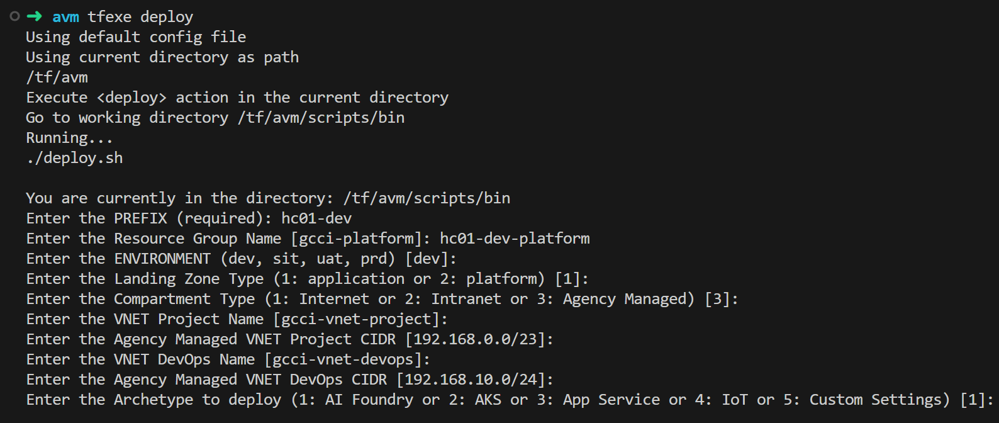

# Starterkit
Starter kit based on Accelerator Framework and allows you to create resources on Microsoft Azure in an Azure subscription. 
This is customized to install in a specific environment setup. 

## Platform team-owned resources
The platform team owns and maintains these centralized resources. This architecture assumes that these resources are pre-provisioned and considers them dependencies.
* **Internet Ingress Firewall**
* **Internet AGW+WAF**
* **Intranet Ingress Firewall**
* **Intranet AGW+WAF**
* **Bastion Host**
* **Tooling Server**

## Workload team-owned resources
The following archetypes are own by the Workload team:

## Archetypes

Archetypes represent standardized deployment patterns that define the structure, components, and best practices for specific types of Azure workloads. Each archetype provides a consistent foundation to accelerate deployment, ensure compliance, and promote reusability across projects.

Below are the supported archetypes, along with links to their respective architecture diagrams for further reference:

* **AI Foundry Archetype**
  Designed for machine learning and AI workloads, this archetype includes components such as Azure Machine Learning, storage accounts, and supporting infrastructure.
  ➤ [View architecture diagram](./docs/ai_archetype.md)

* **AKS Archetype**
  Tailored for containerized applications running on Azure Kubernetes Service (AKS). It includes AKS clusters, networking, and monitoring tools.
  ➤ [View architecture diagram](./docs/aks_archetype.md)

* **App Service Archetype**
  Intended for web applications hosted on Azure App Service. It includes App Service plans, application gateways, and related resources.
  ➤ [View architecture diagram](./docs/appservice_archetype.md)

* **IoT Archetype**
  Focused on Internet of Things solutions. This archetype includes Azure IoT Hub, Stream Analytics, and associated device and data processing components.
  ➤ [View architecture diagram](./docs/iot_archetype.md)


---

# Prerequisites
In order to start deploying your landing zones, you need an Azure subscription (Trial, MSDN, etc.) and you need to install the following components on your machine:

- [Visual Studio Code](https://code.visualstudio.com/)
- [Docker Desktop](https://docs.docker.com/docker-for-windows/install/).
- [Git](https://git-scm.com/downloads)

Once installed, open **Visual Studio Code** and install "**Dev Containers**" extension

# Cloning the starter repository

The starter repository contains the basic configuration files and scenarios. It will allow you to compose your configuration files in the integrated environment.
Clone the repository using the following command:

```bash
git clone https://github.com/AcceleratorFramew0rk/infra-starterkit.git
```
OR

Download the repo as a zip file.

* Open working folder with Visual Studio Code (Note: Reopen in container when prompt in VS Code)
  * (if required) Install VS Code Extension - Dev Containers
* Add a zsh terminal from VS Code
* Follow the steps in README.md file

---

# Deploy the starter kit
## Login to Azure
```bash
az login --tenant xxxxxxxx-xxxxxx-xxxx-xxxx-xxxxxxxxxxxx # azure tenant id
az account set --subscription xxxxxxxx-xxxxxx-xxxx-xxxx-xxxxxxxxxxxx # subscription id
az account show # to show the current login account

SUBSCRIPTION_ID="xxxxxxxx-xxxxxx-xxxx-xxxx-xxxxxxxxxxxx"
export ARM_SUBSCRIPTION_ID="${SUBSCRIPTION_ID}"

# ensure min "execute" right to script to avoid permission issue
sudo chmod -R -f 777 /tf/avm/scripts
sudo chmod -R -f 777 /tf/avm/templates/landingzone/configuration

```

## ** OPTIONAL: Setup GCC Simulator Environment (required for testing and non gcc environment)
```bash
cd /tf/avm/templates/0-setup_gcc_dev_env
terraform init -reconfigure
terraform plan
terraform apply -auto-approve
```

## Deploy Archetype via script

- Open an **zsh** terminal from your visual studio code.

```bash

tfexe deploy

```

#### How to Provide Inputs for Deployment of the Archetypes

* **PREFIX**: Your project’s unique identifier (e.g. `hc01-dev`)
* **RESOURCE GROUP NAME**: Name of the Azure Resource Group to host resources (e.g. `hc01-dev-platform`)
* **ENVIRONMENT**: Deployment environment (`dev`, `sit`, `uat`, `stg`, `prd`; default: `dev`)
* **LANDING ZONE TYPE**: Type of landing zone (Enter `1` = application)
* **COMPARTMENT TYPE**: Type of VNET compartment (Enter `3` = agency managed)
* **VNET PROJECT NAME**: Name of Project VNET (default: `gcci-vnet-project`)
* **VNET PROJECT CIDR**: CIDR of Project Agency Managed VNET (default: `192.168.0.0/23`)
* **VNET DEVOPS NAME**: Name of DevOps VNET (default: `gcci-vnet-devops`)
* **VNET DEVOPS CIDR**: CIDR of DevOps Agency Managed VNET (default: `192.168.10.0/24`)
* **ARCHETYPE**: Deployment archetype 
  - (Enter `1` = AI Foundry archetype)
  - (Enter `2` = AKS archetype)
  - (Enter `3` = App Service archetype)
  - (Enter `4` = IoT archetype)

#### EXAMPLE:



#### If you select '1' for AI Foundry archtetype, manually approved the below search shared private link for Azure Search Services 
* Storage account (Approved via Storage Account UI under  Networking > Private endpoint connections)
* AI Services (Approved via AI Services UI under Networking > Private endpoint connections)

---

### Guidelines for Providing Input Values in Bash Script Prompts

* **PREFEX**

  * Enter your project prefix.
  * Example: `hc01-dev`

* **RESOURCE GROUP NAME**

  * Specify the name of the Azure Resource Group that will host all your resources.
  * Default: `gcci-platform`
  * Example: `hc01-dev-platform`

* **ENVIRONMENT**

  * Specify the project environment.
  * Valid values: `dev`, `sit`, `uat`, `stg`, `prd`
  * Default: `dev`

* **LANDINGZONE TYPE**

  * Choose the type of landing zone.
  * Valid values:

    * `1`: application
    * `2`: platform
  * Default: `1`

* **COMPARTMENT TYPE**

  * Choose the type of VNET Compartment Type.
  * Valid values:

    * `1`: Internet
    * `2`: Intranet
    * `3`: Agency Managed
  * Default: `3`

* **VNET PROJECT NAME**

  * Enter the name of the Project virtual network.
  * Default: `gcci-vnet-project` 

* **VNET PROJECT CIDR**

  * Enter the CIDR of the Project virtual network.
  * Default: `192.168.0.0/23` 

* **VNET DEVOPS NAME**

  * Enter the name of the DevOps virtual network.
  * Default: `gcci-vnet-devops` 

* **VNET DEVOPS CIDR**

  * Enter the CIDR of the DevOps virtual network.
  * Default: `192.168.10.0/24` 

* **ARCHETYPE**

  * Choose the type of archetype to deploy.
  * Valid values:

    * `1`: AI Foundry Archetype
    * `2`: AKS Archetype
    * `3`: App Service Archetype
    * `4`: IoT Archetype
    * `5`: Custom Archetype (you define your own settings.yaml file in "/tf/avm/scripts/config/settings.yaml")
  * Default: `1`

* **SETTINGS YAML FILE PATH**

  * Enter the path of the settings.yaml file.
  * Default: `/tf/avm/scripts/config/settings.yaml` 

---

